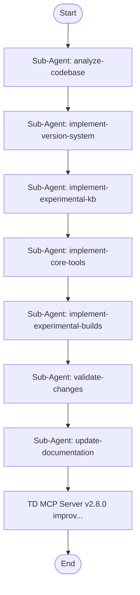

## Workflow Execution Guide

Follow the Mermaid flowchart above to execute the workflow. Each node type has specific execution methods as described below.

### Execution Methods by Node Type

- **Rectangle nodes (Sub-Agent: ...)**: Execute Sub-Agents
- **Diamond nodes (AskUserQuestion:...)**: Use the AskUserQuestion tool to prompt the user and branch based on their response
- **Diamond nodes (Branch/Switch:...)**: Automatically branch based on the results of previous processing (see details section)
- **Rectangle nodes (Prompt nodes)**: Execute the prompts described in the details section below

## Sub-Agent Node Details

#### analyze_codebase(Sub-Agent: analyze-codebase)

**Description**: Analyzes current TD MCP Server state and plans improvements

**Model**: sonnet

**Prompt**:

```
Analyze the current state of the TouchDesigner MCP Server project at /home/robert/Documents/TD-MCP/touchdesigner-mcp-server. Read CHANGELOG.md, README.md, MCP-ARCHITECTURE.md, package.json, and scan the tools/ and wiki/data/ directories. Identify: (1) the 12 existing tools and their capabilities, (2) improvements already made in v2.7.0, (3) the five planned improvement streams: Version System, Experimental Techniques KB, Core Tool Enhancements, Experimental Build Support, and All Streams Combined. Return a concise summary of current state and confirm readiness to proceed with all improvements automatically.
```

#### implement_version_system(Sub-Agent: implement-version-system)

**Description**: Implements TD version tracking and compatibility filtering

**Model**: sonnet

**Prompt**:

```
Implement the Version System for the TouchDesigner MCP Server at /home/robert/Documents/TD-MCP/touchdesigner-mcp-server. Tasks: (1) Create wiki/data/versions/ directory with version-manifest.json (TD versions 099, 2019, 2020, 2021, 2022, 2023, 2024 with Python version per release), operator-compatibility.json (30+ operators with addedIn/changedIn/removedIn fields), python-api-compatibility.json (method-level version tracking), and release-highlights.json (key features per major version). (2) Create wiki/utils/version-filter.js with isCompatible(), filterByVersion(), getVersionIndex() functions. (3) Create tools/get_version_info.js — returns TD version info, Python version, and key features. (4) Create tools/list_versions.js — lists all supported TD versions with highlights. (5) Add optional 'version' parameter to search_operators.js, get_operator.js, search_python_api.js, get_python_api.js for version-filtered results. (6) Register both new tools in index.js. (7) Append to CHANGELOG.md under a new section. Implement fully and verify with node --check.
```

#### implement_experimental_kb(Sub-Agent: implement-experimental-kb)

**Description**: Builds GLSL, GPU, ML, and audio-visual experimental techniques KB

**Model**: sonnet

**Prompt**:

```
Implement the Experimental Techniques Knowledge Base for the TouchDesigner MCP Server at /home/robert/Documents/TD-MCP/touchdesigner-mcp-server. Tasks: (1) Create wiki/data/experimental/ directory with 7 JSON files: glsl.json (raymarching/SDF, reaction-diffusion, feedback loops, procedural textures — include actual GLSL shader code snippets), gpu-compute.json (Script TOP buffer ops, CUDA, shared memory, GPU instancing), machine-learning.json (TouchEngine CHOP/TOP, ONNX, Stable Diffusion, MediaPipe pose, note requires TD 2022+), generative-systems.json (L-systems, cellular automata, strange attractors, Replicator COMP), audio-visual.json (FFT to geometry, granular synthesis, MIDI-driven visuals, beat detection), networking.json (OSC server/client, WebSocket DAT, NDI streaming, TDAbleton sync), python-advanced.json (asyncio in TD, tdu.Dependency patterns, threading, numpy/scipy/opencv integration). (2) Create tools/get_experimental_techniques.js — browse by category. (3) Create tools/search_experimental.js — search across all categories. (4) Create tools/get_glsl_pattern.js — get specific GLSL patterns with code. (5) Register all 3 new tools in index.js. (6) Append to CHANGELOG.md. Verify with node --check.
```

#### implement_core_tools(Sub-Agent: implement-core-tools)

**Description**: Adds operator connections, network templates, and enhanced search

**Model**: sonnet

**Prompt**:

```
Implement Core Tool Enhancements for the TouchDesigner MCP Server at /home/robert/Documents/TD-MCP/touchdesigner-mcp-server. Tasks: (1) Create tools/get_operator_connections.js — returns what operators typically connect to/from a named operator (inputs, outputs, common chains). (2) Create tools/get_network_template.js — returns full network templates for use cases: video-player, generative-art, audio-reactive, data-visualization, live-performance. Each template includes operator list, connections, parameter settings, and Python scripts. (3) Enhance tools/search_operators.js: add 'type' enum filter (exact/fuzzy/tag), 'limit' param (default 20, max 50), return totalResults count in response. (4) Enhance tools/suggest_workflow.js: add connection port instructions (A output→B input), complexity rating (simple/medium/complex), estimated node count, minimum TD version requirement. (5) Create enriched wiki/data/processed/ files for: feedback_top.json, render_top.json, geo_comp.json, camera_comp.json with full parameters, tips, examples, and Python code. (6) Register 2 new tools in index.js. (7) Append to CHANGELOG.md. Verify with node --check.
```

#### implement_experimental_builds(Sub-Agent: implement-experimental-builds)

**Description**: Implements TD experimental/beta build tracking with feature flags

**Model**: sonnet

**Prompt**:

```
Implement experimental TouchDesigner build support for the TD MCP Server at /home/robert/Documents/TD-MCP/touchdesigner-mcp-server. TouchDesigner releases two tracks: stable builds (2019–2024) and experimental/beta builds with unreleased features. Tasks: (1) Create wiki/data/versions/experimental-builds.json tracking experimental TD build series, their new experimental features, known breaking changes, stability status, and Python API additions. Include at minimum 5 recent experimental build series with feature flags. (2) Create tools/get_experimental_build.js — returns info about a specific experimental build number or the latest experimental build, including new features, breaking changes vs stable, and Python API additions. (3) Create tools/list_experimental_builds.js — lists recent experimental builds grouped by feature area (rendering, Python API, operators, UI). (4) Update wiki/utils/version-filter.js to support experimental build version strings alongside stable versions. (5) Register both new tools in index.js. (6) Append to CHANGELOG.md. (7) Update README.md to note experimental build support. Verify with node --check.
```

#### validate_changes(Sub-Agent: validate-changes)

**Description**: Validates all changes: syntax, exports, JSON integrity, and tool registration

**Model**: sonnet

**Prompt**:

```
Validate all recent changes to the TouchDesigner MCP Server at /home/robert/Documents/TD-MCP/touchdesigner-mcp-server. Tasks: (1) Run node --check on index.js and every file in tools/ to verify zero syntax errors. (2) Verify index.js properly registers all new tools: get_version_info, list_versions, get_experimental_techniques, search_experimental, get_glsl_pattern, get_operator_connections, get_network_template, get_experimental_build, list_experimental_builds. Count should now be 21 registered tools. (3) Validate all new JSON files in wiki/data/versions/ and wiki/data/experimental/ are valid JSON. (4) Confirm CHANGELOG.md has entries for all 4 streams. (5) If any issues are found, fix them immediately before proceeding. Report final tool count and any fixes applied.
```

#### update_documentation(Sub-Agent: update-documentation)

**Description**: Updates README, MCP-ARCHITECTURE, and CHANGELOG for v2.8.0

**Model**: sonnet

**Prompt**:

```
Update all documentation for the TouchDesigner MCP Server at /home/robert/Documents/TD-MCP/touchdesigner-mcp-server to reflect the v2.8.0 improvements. Tasks: (1) Update README.md: increment tool count to 21, add descriptions of all 9 new tools, update capability list with Version System, Experimental KB, Core Enhancements, and Experimental Build Support sections. (2) Update MCP-ARCHITECTURE.md: fix Python class count to 69 (not 553), add all new tools to the architecture diagram and tool table, update data inventory with new wiki/data/versions/ and wiki/data/experimental/ directories. (3) Finalize CHANGELOG.md: ensure there is a clean ## [2.8.0] entry with all changes listed under Added/Enhanced/Fixed sections. (4) Update package.json version to 2.8.0. (5) Update SETUP-INSTRUCTIONS.md if any new setup steps are needed. Ensure documentation is accurate, professional, and consistent.
```

### Prompt Node Details

#### completion_prompt(TD MCP Server v2.8.0 improv...)

```
TD MCP Server v2.8.0 improvement workflow complete.

All 4 improvement streams have been implemented, validated, and documented:
- Stream 1: Version System (get_version_info, list_versions)
- Stream 2: Experimental Techniques KB (get_experimental_techniques, search_experimental, get_glsl_pattern)
- Stream 3: Core Tool Enhancements (get_operator_connections, get_network_template)
- Stream 4: Experimental Build Support (get_experimental_build, list_experimental_builds)

Total tools: 21 (was 12)

Next steps:
1. Test with your MCP client
2. Run: npm publish
3. Update the GitHub repository
```
